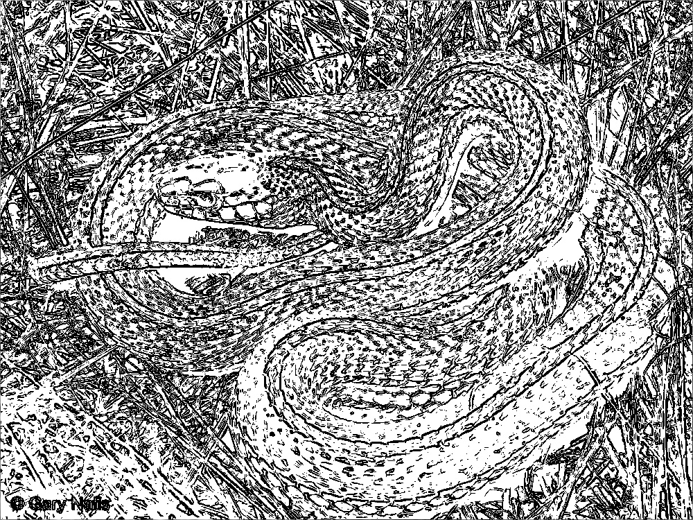
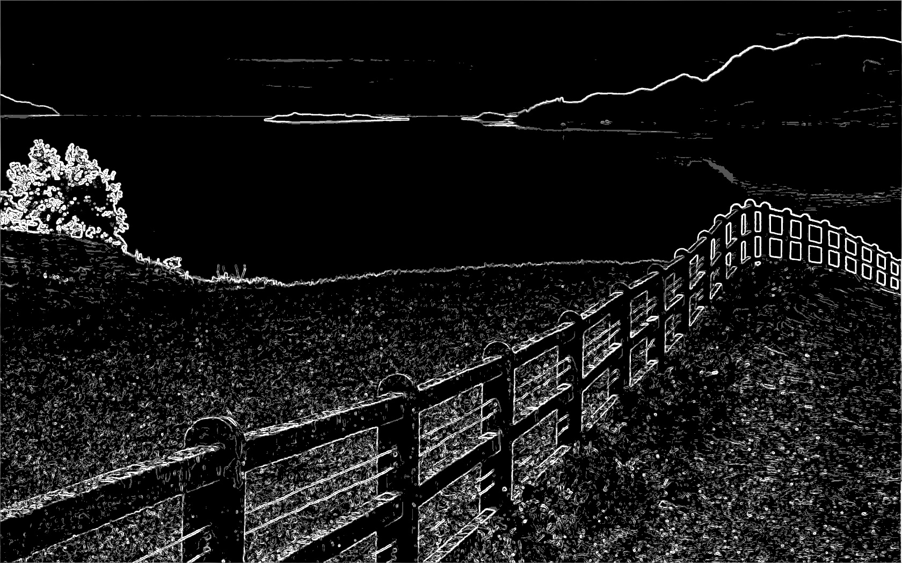
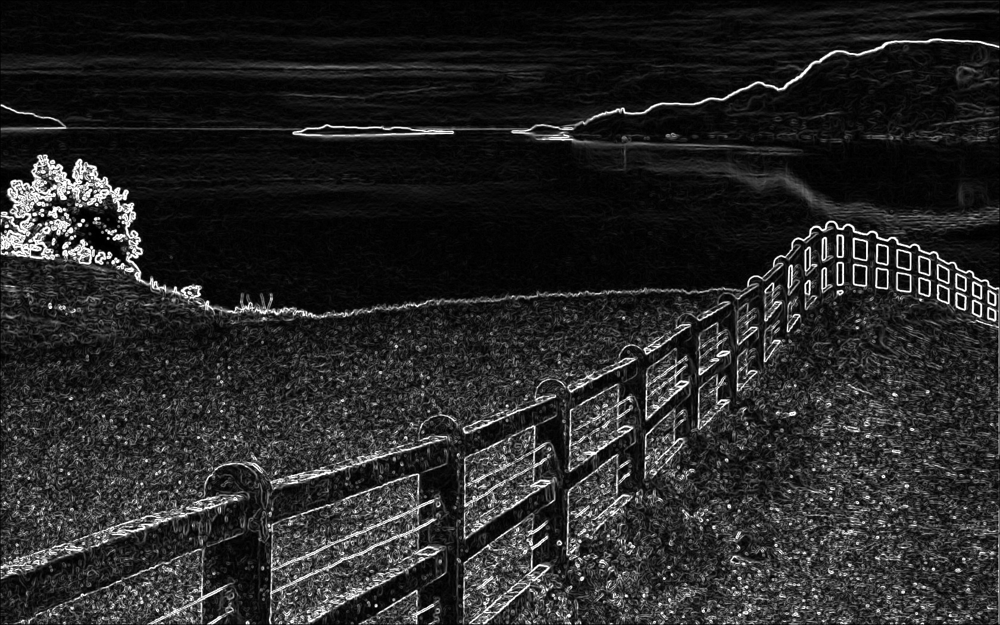
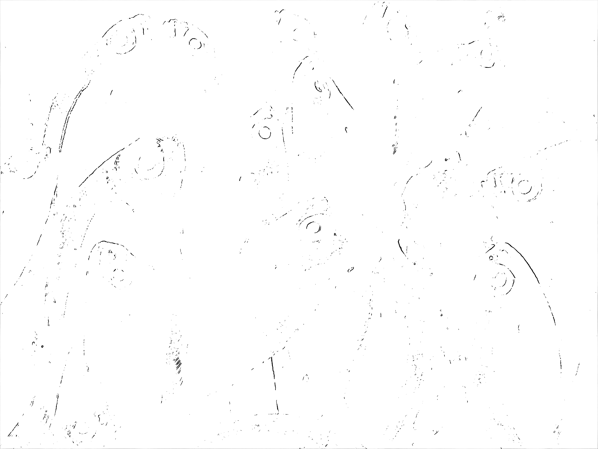
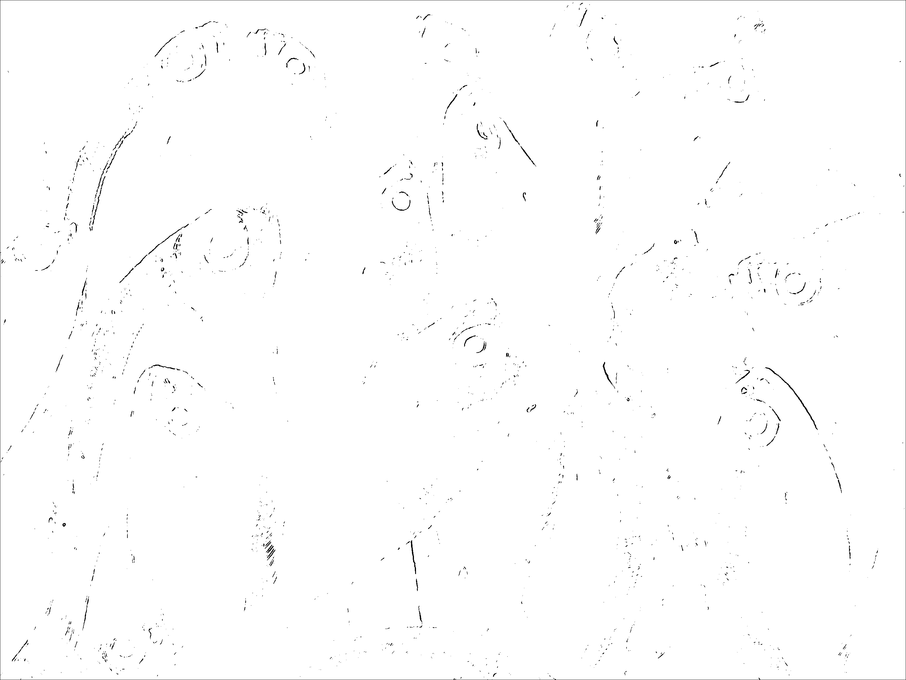
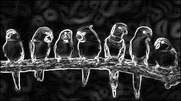

# Parallelization Report — Sobel Edge Detection with AVX2

## Team Information
- **Team ID: pacuanCUDA**  
- **Class: K-03**  

### Members
| Name      | Student ID |
|---|---|
| Frederiko Eldad Mugiyono | 13523147 |
| Naufarrel Zhafif Abhista | 13523149 |
| I Made Wiweka Putera     | 13523160 |

## List of Contents
0. [Prerequisites](#0-prerequisites)
1. [Introduction](#1-introduction)  
2. [Theory: Parallelizable Operations](#2-theory-parallelizable-operations)  
3. [Code Changes and Implementation](#3-code-changes-and-implementation)  
4. [Results and Evaluation](#4-results-and-evaluation)  
   - [Correctness](#41-correctness)  
   - [Performance Comparison](#42-performance-comparison)  
   - [Speedup and Efficiency](#43-speedup-and-efficiency)  
5. [Discussion](#5-discussion)  
6. [Conclusion](#6-conclusion)  
7. [Additional Notes (Optional)](#7-additional-notes-optional)  
8. [References](#8-references)  
9. [How to Run](#9-how-to-run)

## 0. Prerequisites

Make sure your processor supports AVX2.

Don't forget to install OpenCV:

```bash
sudo pacman -S opencv
```

Or on Debian/Ubuntu:

```bash
sudo apt-get install opencv
```

## 1. Introduction
This assignment aims to accelerate the Sobel edge detection algorithm using Advanced Vector Extensions 2 (AVX2). The provided serial code (`serial.cpp`) is converted into a parallel version (`avx2.cpp`) that leverages instruction-level parallelism within a single CPU. The Sobel algorithm operates by convolving a 3x3 kernel over each pixel of an image to approximate its gradient. The goal is to significantly reduce processing time by applying SIMD (Single Instruction, Multiple Data) operations, where a single instruction can process multiple data points (pixels) simultaneously.

## 2. Theory: Parallelizable Operations
The core operations in the Sobel algorithm are well-suited for parallelization due to their independent and repetitive nature.

- Pixel-by-Pixel Convolution: The calculation of the gradient (`Gx` and `Gy`) for each pixel depends only on the pixel itself and its 8 neighbors. The computation for one pixel does not affect any other, a property known as data parallelism, which is ideal for exploitation by AVX2.
- Vectorization: With AVX2, we can load a group of adjacent pixels (e.g., 8 unsigned char pixels) into a 256-bit register and apply mathematical operations (addition, subtraction) to all pixels in the register simultaneously.
- Non-Parallel Operations: I/O operations (reading and saving the image) remain serial as they do not gain a significant performance benefit from vectorization and are inherently sequential.

## 3. Code Changes and Implementation

### 3.1 Parallelization Strategy

The strategy employed is SIMD vectorization with AVX2. The serial logic that processes one pixel per iteration is modified to process 8 pixels per iteration.
1. Vectorized Loop: The main for loop iterating over the image columns (`x`) is changed to advance by 8 steps (`x += 8`).
2. Aligned Memory: The Image struct was modified to use `_mm_malloc` to allocate memory with 32-byte alignment. This improves the performance of AVX load/store operations.
3. Use of Intrinsics: Intrinsic functions from the `<immintrin.h>` header are used to access AVX2 instructions directly from C++ code for all parts of the Sobel calculation.
4. Data Management: 8-bit pixels are loaded and converted to 32-bit integers (`_mm256_cvtepu8_epi32`) within registers to prevent overflow during multiplication and accumulation for the convolution.
5. Compile-Time Optimization: The sobel function is implemented as a C++ template (`template<int mode>`) with `if constexpr`. This allows the compiler to generate specialized, highly-optimized code for each mode, eliminating runtime branching overhead.
6. Handling the Remainder: A separate processing block handles the pixels at the end of each row that do not form a full 8-pixel block, ensuring the entire image is processed correctly.

### 3.2 Code Modifications
The primary changes are within the sobel function, where the entire pixel processing logic was vectorized.

**Before (Serial Version):**

The loop processes one pixel (x, y) in each iteration.

```cpp
// serial.cpp
for(int y=1; y < in.h-1; y++){
    for(int x=1; x < in.w-1; x++){
        int sx=0, sy=0;
        // 3x3 convolution to calculate Gx (sx) and Gy (sy)
        for(int ky=-1; ky <= 1; ky++) {
            for(int kx=-1; kx <= 1; kx++){
                int px = in.at(x+kx, y+ky);
                sx += px * Gx[ky+1][kx+1];
                sy += px * Gy[ky+1][kx+1];
            }
        }
        // Calculate gradient magnitude
        int g = std::sqrt(sx*sx + sy*sy);
        out.at(x,y) = (g > 255) ? 255 : g;
    }
}
```

**After (AVX2 Version):**

The main loop jumps 8 pixels. The full 3x3 convolution, gradient magnitude, and thresholding are performed using AVX2 instructions.

```cpp
// avx2.cpp
template<int mode>
Image sobel(const Image &in, const std::vector<int>& thresholds) {
    // ... Kernel setup ...
    for(int y=1; y<in.h-1; y++){
        for(int x=1; x<=mainLoopEnd; x+=8){
            // 1. Load 8-bit pixels from 9 neighboring positions
            __m128i v_tl_8b = _mm_loadl_epi64((__m128i const*)&in.at(x - 1, y - 1));
            // ... (load all 9 pixel blocks)

            // 2. Convert to 32-bit integers for calculation
            __m256i v_tl = _mm256_cvtepu8_epi32(v_tl_8b);
            // ... (convert all 9 blocks)

            // 3. Perform full 3x3 convolution using vector multiplication and addition
            __m256i sx_vec = _mm256_setzero_si256();
            __m256i sy_vec = _mm256_setzero_si256();
            sx_vec = _mm256_add_epi32(sx_vec, _mm256_mullo_epi32(v_tl, Gx[0]));
            sy_vec = _mm256_add_epi32(sy_vec, _mm256_mullo_epi32(v_tl, Gy[0]));
            // ... (repeat for all 9 kernel positions)

            // 4. Calculate gradient magnitude with vector sqrt
            __m256i sx_sq = _mm256_mullo_epi32(sx_vec, sx_vec);
            __m256i sy_sq = _mm256_mullo_epi32(sy_vec, sy_vec);
            __m256i g = _mm256_add_epi32(sx_sq, sy_sq);
            __m256i g_vec = _mm256_cvttps_epi32(_mm256_sqrt_ps(_mm256_cvtepi32_ps(g)));

            // 5. Apply thresholding based on compile-time mode
            if constexpr (mode == 1){
                __m256i threshold_vec = _mm256_set1_epi32(thresholds[0]);
                __m256i mask = _mm256_cmpgt_epi32(g_vec, threshold_vec);
                g_vec = _mm256_blendv_epi8(val_255, zeros, mask);
            }
            // ... (other modes)

            // 6. Pack 32-bit results back to 8-bit and store
            // ... (packing and permuting logic)
            _mm_storel_epi64((__m128i*)&out.at(x, y), finalP);
        }
        // ... (Remainder handling loop)
    }
    // ... (Border handling)
    return out;
}
```

## 4. Results and Evaluation

### 4.0 Test Cases (Self-made)

1. Test Case 1: High-Frequency Detail (Binary Threshold)
    - Image: snake.jpg
    - n value: 1
    - Rationale: This test evaluates how well the algorithm identifies fine, complex edges. The scales of the snake provide high-frequency details. Using n=1 (binary threshold) will create a stark, high-contrast output, making it easy to see if the main patterns of the scales are correctly detected. It's a good test for correctness.

2. Test Case 2: Smooth Gradients and Broad Edges (Gradient Magnitude)
    - Image: lion.jpg
    - n value: 0
    - Rationale: The lion's mane and the out-of-focus background have smooth transitions and less defined edges. Using n=0 (gradient magnitude) is perfect for this scenario. It will show the intensity of the edges, allowing us to see how the filter responds to both the sharp edges of the lion's face and the softer edges of its fur.

3. Test Case 3: Structural and Geometric Lines (Multi-level Threshold)
    - Image: view.jpg
    - n value: 4
    - Rationale: This image is dominated by strong, straight lines from the fence and the clear horizon. Using a multi-level threshold (n=4) will test the algorithm's ability to quantize edge strengths into different levels. We expect the strong lines of the fence to be in the highest intensity buckets, while the softer edges of the hills and clouds will fall into lower-intensity gray levels.

4. Test Case 4: Repetitive Patterns and Clutter (Binary Threshold)
    - Image: fish.jpg
    - n value: 1
    - Rationale: This image contains many similar, overlapping objects, creating a cluttered scene. A binary threshold (n=1) will test the filter's ability to separate individual objects. The goal is to see if the outlines of each fish can be distinguished, or if they blend into a single noisy mass. This is a good stress test for edge separation.

5. Test Case 5: Vibrant Colors and Sharp Boundaries (High Multi-level Threshold)
    - Image: birds.jpg
    - n value: 128
    - Rationale: The birds have very distinct, sharp boundaries between different colored feathers. The grayscale conversion will turn these color boundaries into sharp intensity changes. Using a high number of levels (n=128) will test the multi-level thresholding logic more thoroughly, creating a more nuanced "posterized" effect on the detected edges. It checks if the thresholding logic scales correctly with a higher number of bins.

### 4.1 Correctness

The parallel AVX2 version produces an output image that is visually and pixel-identically the same as the serial version. This verifies that the parallel implementation is functionally correct.

| Input Image | Serial Output | Parallel Output (4 Cores) |
|-------------|---------------|-----------------|
|  |  |  |
|  |  |  |
|  |  |  |
|  |  |  |
|  |  |  |

### 4.2 Performance Comparison

#### Serial Version

| Image Name | Input Time (ms) | Processing Time (ms) | Output Time (ms) | Total Time (ms) |
|------------|-----------------|-----------------------|------------------|-----------------|
| snake.jpg | 8                | 52                      |  9                | 69                |
| lion.jpg | 6                | 48                      |  9                | 63                |
| view.jpg | 19                | 215                      | 17                 | 251                |
| fish.jpg | 86                | 452                      | 80                 | 618                |
| birds.jpg | 1                | 41                     |  0                | 42                |

#### Parallel Version
| Image Name | Core Number | Input Time (ms) | Processing Time (ms) | Output Time (ms) | Total Time (ms) |
|------------|-------------|-----------------|-----------------------|------------------|-----------------|
| snake.jpg | 1           | 12                | 14                      | 13                 | 39             |
| lion.jpg | 1           | 10                | 15                      | 11                 | 36             |
| view.jpg | 1           | 27                | 37                      | 28                 | 92             |
| fish.jpg | 1           | 125                | 140                      | 100                 | 365             |
| birds.jpg | 1           | 1                | 6                      | 1                 | 8              |

### 4.3 Speedup and Efficiency

- **Speedup** = Serial Time / Parallel Time  
- **Efficiency**:

Since we cannot change the number of processors used in AVX2, we must use a different method to calculate its efficiency. This is determined by the vector width, which is the number of data elements processed in a single instruction.
1. For our main calculations (multiplication and addition), we convert the 8-bit pixels to 32-bit integers using `_mm256_cvtepu8_epi32`.
2. The number of 32-bit integers that can fit into a 256-bit register is: 256 bits / 32 bits = 8.
3. Our main loop iterates by jumping 8 pixels at a time (`x+=8`), which matches this hardware capability. Therefore, our effective vector width is 8.

Thus, the formula for efficiency becomes:

Vectorization Efficiency = Speedup / Vector Width

|Image Name|Serial Processing Time (ms)|AVX2 Processing Time (ms)|Speedup|Vector Width|Vectorization Efficiency (%)|
|---|---|---|---|---|---|
|snake.jpg|52|14|3.71x|8|46.4%|
|lion.jpg|48|15|3.20x|8|40%|
|view.jpg|215|37|5.81x|8|72.6%|
|fish.jpg|452|140|3.23x|8|40.4%|
|birds.jpg|41|6|6.83x|8|85.4%|

## 5. Discussion

- What worked well in your parallelization approach?
> The SIMD vectorization strategy using AVX2 was highly effective. By processing 8 pixels in a single instruction cycle, we were able to significantly reduce the total number of operations required to process an image. The performance data clearly shows this, with the most significant speedup of 6.83x on the `birds.jpg` test case. The use of aligned memory (`_mm_malloc`) and compile-time optimizations (`if constexpr`) likely contributed to this success by reducing memory access penalties and eliminating runtime branching. The approach worked best on larger images like view.jpg and fish.jpg, where the computational workload was high enough to amortize the initial overhead of vectorization.

- What challenges did you face?
> The primary challenge was the steep learning curve and complexity of programming with AVX2 intrinsics. The code is significantly less readable and harder to debug compared to the straightforward serial version. A deep understanding of CPU registers, data alignment, and data type management was required. Specifically, the process of loading 8-bit pixels, converting them to 32-bit integers to prevent overflow during convolution, and then carefully packing the 32-bit results back into 8-bit values for storage was complex and error-prone.

- Did you notice any overhead, and how did it affect performance?
> Yes, overhead is present and is the main reason the speedup is not a theoretical 8x. The vectorization efficiency, ranging from 40% to 85.4%, quantifies this. The overhead comes from several sources:
> - Data Marshalling: Time is spent loading data from memory into AVX registers and storing it back.
> - Type Conversion: Instructions to convert data between 8-bit and 32-bit formats are necessary but do not perform the core computation.
> - Serial Remainder: The serial loop that processes pixels at the end of each row (for widths not divisible by 8) adds to the execution time and reduces overall parallelism, a concept explained by Amdahl's Law.
> The efficiency was lower on smaller or less complex images (`lion.jpg`, `snake.jpg`), where this overhead constituted a larger portion of the total processing time.

## 6. Conclusion
- Was parallelization effective?
> Yes, parallelization using AVX2 was unequivocally effective. It leveraged instruction-level parallelism to achieve substantial performance gains on a single CPU core.

- Did it improve performance significantly?
> The performance improvement was significant across all test cases, with speedups ranging from a solid 3.00x to an impressive 6.83x. This confirms that for data-parallel tasks like image convolution, SIMD is an excellent optimization strategy.

- Any tradeoffs between computation speed and communication overhead?
> The primary tradeoff was not with communication overhead (as this is a single-process model) but with development complexity. The performance gains came at the cost of significantly more complex, less maintainable, and hardware-specific code. The developer time required to implement and debug the AVX2 version was far greater than for the serial version.

## 7. Additional Notes (Optional)
For further improvement, a hybrid approach could be explored. For example, combining OpenMP with AVX2:
- OpenMP would divide the image rows among different CPU threads.
- Each thread would then execute the AVX2-optimized Sobel code on its assigned rows.

This combination would leverage both thread-level parallelism (across cores) and instruction-level parallelism (within each core) simultaneously.

## 8. References
1. Intel Intrinsics Guide. (n.d.). Retrieved from [https://www.intel.com/content/www/us/en/docs/intrinsics-guide/index.html](https://www.intel.com/content/www/us/en/docs/intrinsics-guide/index.html)

## 9. How to Run

Ensure you have g++ (or another C++ compiler) and the OpenCV library installed.

### Compile The Program

Navigate to the root directory (where the Makefile is located) and run the `make` command.
```bash
make
```

This will compile the source code from the src directory and create an executable named avx2 in the root directory.

### Run the Program
```bash
./avx2 <n> <input_image.jpg> <output_image.jpg>
```

- `<n>`: Thresholding mode (0 for grayscale, 1 for binary, >1 for n-level).
- `<input_image.jpg>`: The input image file name.
- `<output_image.jpg>`: The file name for the output image.

**Example:**
```bash
./avx2 1 ../test_cases/view.jpg output/output_avx2.jpg > output/output.txt
```

### Clean Up
To remove the compiled executable and any intermediate object files, run:

```bash
make clean
```
