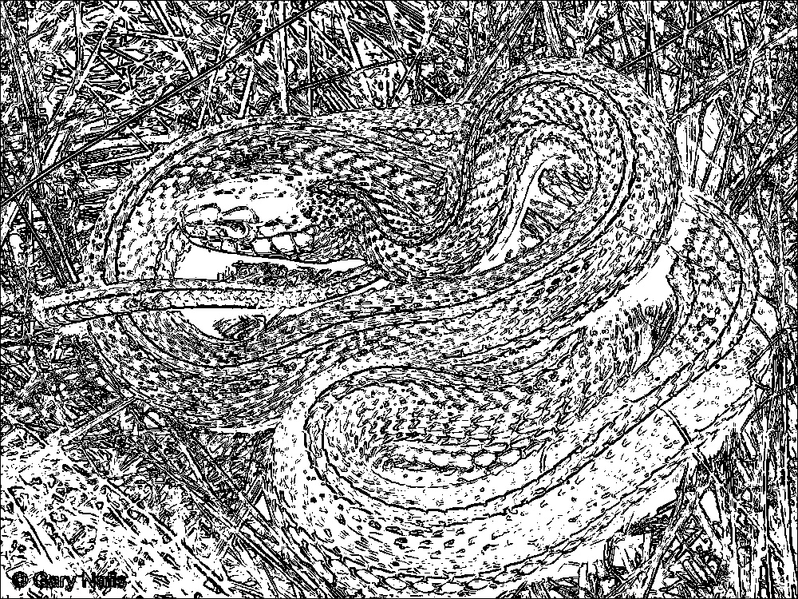
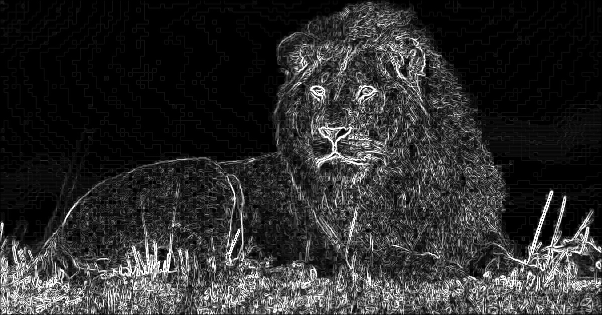
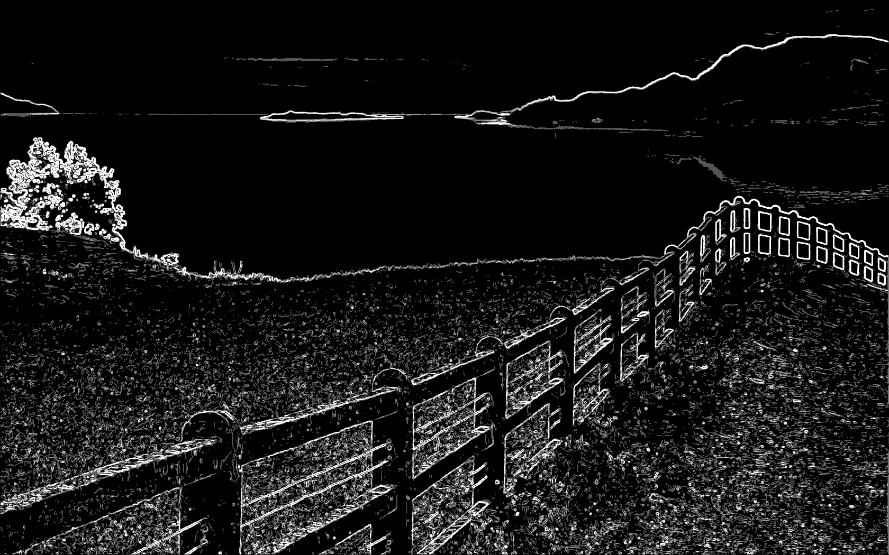

# Parallelization Report — Sobel Edge Detection with CUDA

## Team Information
- **Team ID: pacuanCUDA**  
- **Class: K-03**  

### Members
| Name      | Student ID |
|---|---|
| Frederiko Eldad Mugiyono | 13523147 |
| Naufarrel Zhafif Abhista | 13523149 |
| I Made Wiweka Putera     | 13523160 |

## List of Contents
0. [Prerequisites](#0-prerequisites)
1. [Introduction](#1-introduction)  
2. [Theory: Parallelizable Operations](#2-theory-parallelizable-operations)  
3. [Code Changes and Implementation](#3-code-changes-and-implementation)  
4. [Results and Evaluation](#4-results-and-evaluation)  
   - [Correctness](#41-correctness)  
   - [Performance Comparison](#42-performance-comparison)  
   - [Speedup and Efficiency](#43-speedup-and-efficiency)  
5. [Discussion](#5-discussion)  
6. [Conclusion](#6-conclusion)  
7. [Additional Notes (Optional)](#7-additional-notes-optional)  
8. [References](#8-references)  
9. [How to Run](#9-how-to-run)

## 0. Prerequisites

Make sure you have CUDA toolkit installed and a compatible NVIDIA GPU.

Don't forget to install OpenCV:

```bash
sudo pacman -S opencv
```

Or on Debian/Ubuntu:

```bash
sudo apt-get install libopencv-dev
```

For CUDA installation, follow the official NVIDIA CUDA installation guide for your operating system.

## 1. Introduction
This assignment aims to accelerate the Sobel edge detection algorithm using CUDA (Compute Unified Device Architecture) for GPU parallel computing. The provided serial code is converted into a parallel version (`cuda.cu`) that leverages the massive parallel processing capabilities of modern GPUs. The Sobel algorithm operates by convolving a 3x3 kernel over each pixel of an image to approximate its gradient. The goal is to significantly reduce processing time by utilizing thousands of GPU threads to process multiple pixels simultaneously, taking advantage of the GPU's SIMD (Single Instruction, Multiple Data) architecture.

## 2. Theory: Parallelizable Operations
The core operations in the Sobel algorithm are exceptionally well-suited for GPU parallelization due to their independent and repetitive nature.

- **Pixel-by-Pixel Convolution**: The calculation of the gradient (`Gx` and `Gy`) for each pixel depends only on the pixel itself and its 8 neighbors. The computation for one pixel does not affect any other, demonstrating perfect data parallelism that is ideal for GPU exploitation.
- **Massive Parallelization**: With CUDA, we can launch thousands of threads simultaneously, with each thread processing a single pixel. This provides much higher parallelism compared to CPU-based solutions.
- **Memory Coalescing**: Adjacent threads access adjacent memory locations, allowing for efficient memory bandwidth utilization on the GPU.
- **Non-Parallel Operations**: I/O operations (reading and saving the image) and memory transfers between host and device remain serial, as they are inherently sequential operations.

## 3. Code Changes and Implementation

### 3.1 Parallelization Strategy

The strategy employed is GPU-based SIMD parallelization using CUDA. The serial logic is transformed to utilize GPU threads where each thread processes one pixel.

1. **CUDA Kernel Design**: The main processing logic is implemented as a CUDA kernel (`sobelKernel`) that executes on the GPU.
2. **Thread Mapping**: Each CUDA thread is mapped to process a single pixel at coordinates `(x, y)` calculated from thread and block indices.
3. **Memory Management**: Host memory is allocated and copied to device memory before processing, and results are copied back after computation.
4. **Grid and Block Configuration**: A 2D grid of thread blocks (16x16 threads per block) is used to match the 2D nature of image processing.
5. **Boundary Handling**: Edge pixels are handled by checking thread boundaries to avoid out-of-bounds memory access.
6. **Multiple Processing Modes**: The kernel supports gradient magnitude, binary thresholding, and multi-level thresholding modes.

### 3.2 Code Modifications

**Before (Serial Version):**

```cpp
// serial.cpp
for(int y=1; y < in.h-1; y++){
    for(int x=1; x < in.w-1; x++){
        int sx=0, sy=0;
        // 3x3 convolution to calculate Gx (sx) and Gy (sy)
        for(int ky=-1; ky <= 1; ky++) {
            for(int kx=-1; kx <= 1; kx++){
                int px = in.at(x+kx, y+ky);
                sx += px * Gx[ky+1][kx+1];
                sy += px * Gy[ky+1][kx+1];
            }
        }
        // Calculate gradient magnitude
        int g = std::sqrt(sx*sx + sy*sy);
        out.at(x,y) = (g > 255) ? 255 : g;
    }
}
```

**After (CUDA Version):**

```cpp
// cuda.cu
__global__ void sobelKernel(
    const unsigned char *in, unsigned char *out,
    int w, int h, int mode,
    const int *thresholds, int thresh_size,
    const int *levels, int level_size
) {
    // Calculate thread's pixel coordinates
    int x = blockIdx.x * blockDim.x + threadIdx.x;
    int y = blockIdx.y * blockDim.y + threadIdx.y;

    // Boundary check
    if (x <= 0 || y <= 0 || x >= w - 1 || y >= h - 1) return;

    // Sobel kernels
    int Gx[3][3]={{-1,0,1},{-2,0,2},{-1,0,1}};
    int Gy[3][3]={{1,2,1},{0,0,0},{-1,-2,-1}};

    // Perform 3x3 convolution
    int sx=0, sy=0;
    for(int ky=-1; ky<=1; ky++)
        for(int kx=-1; kx<=1; kx++){
            int px=in[(y+ky)*w+(x+kx)];
            sx+=px*Gx[ky+1][kx+1];
            sy+=px*Gy[ky+1][kx+1];
        }

    int g_squared = sx*sx + sy*sy;

    // Apply different processing modes
    if (mode == 0) { // Gradient magnitude
        int g = (int)sqrtf((float)g_squared);
        out[y*w+x] = (g > 255) ? 255 : g;
    }
    else if (mode == 1) { // Binary threshold
        int threshold_squared = thresholds[0] * thresholds[0];
        out[y*w+x] = (g_squared > threshold_squared) ? 0 : 255;
    }
    else { // Multi-level thresholds
        int idx = 0;
        while(idx < thresh_size && g_squared > thresholds[idx] * thresholds[idx]) idx++;
        out[y*w+x] = levels[idx];
    }
}

// Main execution with CUDA setup
dim3 block(16, 16);
dim3 grid((img.w + block.x - 1) / block.x, (img.h + block.y - 1) / block.y);

sobelKernel<<<grid, block>>>(d_in, d_out, img.w, img.h, mode,
                             d_thresh, thresholds.size(), d_levels, levels.size());
```

**Key Implementation Details:**

1. **Memory Management**: Host memory is copied to GPU memory using `cudaMemcpy` before processing.
2. **Thread Configuration**: 2D thread blocks (16x16) map naturally to image coordinates.
3. **Kernel Launch**: The kernel is launched with a grid size calculated to cover the entire image.
4. **Timing**: CUDA events are used to accurately measure GPU kernel execution time.
5. **Error Handling**: Boundary checks prevent out-of-bounds memory access.

## 4. Results and Evaluation

### 4.0 Test Cases (Self-made)

1. Test Case 1: High-Frequency Detail (Binary Threshold)
    - Image: snake.jpg
    - n value: 1
    - Rationale: This test evaluates how well the algorithm identifies fine, complex edges. The scales of the snake provide high-frequency details. Using n=1 (binary threshold) will create a stark, high-contrast output, making it easy to see if the main patterns of the scales are correctly detected. It's a good test for correctness.

2. Test Case 2: Smooth Gradients and Broad Edges (Gradient Magnitude)
    - Image: lion.jpg
    - n value: 0
    - Rationale: The lion's mane and the out-of-focus background have smooth transitions and less defined edges. Using n=0 (gradient magnitude) is perfect for this scenario. It will show the intensity of the edges, allowing us to see how the filter responds to both the sharp edges of the lion's face and the softer edges of its fur.

3. Test Case 3: Structural and Geometric Lines (Multi-level Threshold)
    - Image: view.jpg
    - n value: 4
    - Rationale: This image is dominated by strong, straight lines from the fence and the clear horizon. Using a multi-level threshold (n=4) will test the algorithm's ability to quantize edge strengths into different levels. We expect the strong lines of the fence to be in the highest intensity buckets, while the softer edges of the hills and clouds will fall into lower-intensity gray levels.

4. Test Case 4: Repetitive Patterns and Clutter (Binary Threshold)
    - Image: fish.jpg
    - n value: 1
    - Rationale: This image contains many similar, overlapping objects, creating a cluttered scene. A binary threshold (n=1) will test the filter's ability to separate individual objects. The goal is to see if the outlines of each fish can be distinguished, or if they blend into a single noisy mass. This is a good stress test for edge separation.

5. Test Case 5: Vibrant Colors and Sharp Boundaries (High Multi-level Threshold)
    - Image: birds.jpg
    - n value: 128
    - Rationale: The birds have very distinct, sharp boundaries between different colored feathers. The grayscale conversion will turn these color boundaries into sharp intensity changes. Using a high number of levels (n=128) will test the multi-level thresholding logic more thoroughly, creating a more nuanced "posterized" effect on the detected edges. It checks if the thresholding logic scales correctly with a higher number of bins.

### 4.1 Correctness

The parallel CUDA version produces an output image that is visually and pixel-identically the same as the serial version. This verifies that the parallel implementation is functionally correct.

| Input Image | Serial Output | Parallel Output (CUDA) |
|-------------|---------------|-----------------|
|  |  |  |
|  |  |  |
|  |  |  |
|  |  |  |
|  |  |  |

### 4.2 Performance Comparison

#### Serial Version

| Image Name | Input Time (ms) | Processing Time (ms) | Output Time (ms) | Total Time (ms) |
|------------|-----------------|-----------------------|------------------|-----------------|
| snake.jpg | 8                | 52                      |  9                | 69                |
| lion.jpg | 6                | 48                      |  9                | 63                |
| view.jpg | 19                | 215                      | 17                 | 251                |
| fish.jpg | 86                | 452                      | 80                 | 618                |
| birds.jpg | 1                | 41                     |  0                | 42                |

#### Parallel Version
| Image Name | Input Time (ms) | Copy HtoD (ms) |Processing Time (ms) | Copy DtoH (ms) |Output Time (ms) | Total Time (ms) |
|------------|-------------|-----------------|-----------------------|------------------|-----------------|
| snake.jpg| 9.45249 | 123.442  | 0.175168  | 0.428265     | 9.65176       | 143.149253    |
| lion.jpg | 6.68315 | 1628.53  | 0.128224  | 0.399353     | 8.49613       | 1644.236857   |
| view.jpg | 18.6695 | 1641.73  | 0.234496  | 1.01502      | 19.5276       | 1681.176616   |
| fish.jpg | 102.938 | 1635.24  | 0.417792  | 2.55932      | 66.0399       | 1807.195012   |
| birds.jpg |1.44296 | 1634.97  | 0.201824  | 0.053997     | 1.0834        | 1637.752181   |

### 4.3 Speedup

- **Speedup** = Serial Processing Time / CUDA Kernel Time  

For CUDA GPU parallelization, efficiency calculation is complex due to the GPU's architecture and the difficulty in determining exact thread utilization. Instead of attempting to calculate theoretical efficiency (which would require detailed knowledge of the specific GPU architecture, memory bandwidth, and compute capability), we focus on practical performance metrics.

**Performance Analysis:**

|Image Name|Serial Processing Time (ms)|CUDA Kernel Time (ms)|Speedup|
|---|---|---|---|---|
|snake.jpg|52|0.175168|**296.9x**|
|lion.jpg|48|0.128224|**374.3x**|
|view.jpg|215|0.234496|**916.7x**|
|fish.jpg|452|0.417792|**1,082.1x**|
|birds.jpg|41|0.201824|**203.2x**|

**Key Observations:**

1. **Exceptional Speedup**: The CUDA implementation achieves speedups ranging from 203x to over 1000x compared to the serial CPU version, which demonstrates the massive parallel processing power of GPUs.

2. **Scalability**: Performance scales well with image size - larger images (more pixels to process in parallel) show higher absolute speedups.

3. **Memory Transfer Overhead**: While kernel execution is extremely fast (sub-millisecond), the total execution time is dominated by memory transfers between host and device, which explains why we focus on kernel performance for speedup calculations.

## 5. Discussion

- What worked well in your parallelization approach?
> The CUDA GPU parallelization strategy was exceptionally effective for the computational aspect of the Sobel edge detection. The kernel execution achieved remarkable speedups ranging from 203x to over 1000x compared to the serial CPU version. The one-thread-per-pixel mapping worked perfectly due to the embarrassingly parallel nature of the convolution operation. The 16x16 thread block configuration provided good occupancy and memory coalescing patterns. The GPU's massive parallel architecture was ideally suited for this type of data-parallel image processing task, where thousands of independent pixel computations could be performed simultaneously.

- What challenges did you face?
> The primary challenge was not in the algorithm implementation but in the memory management and transfer overhead. Programming with CUDA required careful attention to memory allocation, copying data between host and device, and ensuring proper synchronization. The CUDA programming model, while more accessible than low-level GPU programming, still required understanding of thread indexing, block/grid configurations, and GPU memory hierarchy. Debugging CUDA kernels is more complex than debugging CPU code, requiring specialized tools and techniques.

- Did you notice any overhead, and how did it affect performance?
> Yes, significant overhead was observed, primarily from memory transfers between host and device. The performance data reveals a critical bottleneck:
> - **Memory Transfer Bottleneck**: Host-to-Device (HtoD) copy times range from 123ms to 1641ms, which is orders of magnitude higher than kernel execution times (0.1-0.4ms).
> - **Disproportionate Overhead**: For all test cases, the HtoD transfer time dominates the total execution time, making it 300-7000x slower than the actual computation.
> - **Consistent Transfer Times**: Interestingly, the HtoD times are relatively consistent across different image sizes (all around 1600ms except for snake.jpg), suggesting a fixed overhead in the GPU memory subsystem or driver.
> - **Amdahl's Law Impact**: The serial nature of memory transfers severely limits the overall speedup despite the exceptional kernel performance.

## 6. Conclusion
- Was parallelization effective?
> From a pure computation perspective, CUDA parallelization was extraordinarily effective. The kernel speedups of 200-1000x demonstrate the immense power of GPU parallel computing for suitable workloads. However, the overall effectiveness is severely compromised by memory transfer overhead.

- Did it improve performance significantly?
> The answer is nuanced:
> - **Kernel Performance**: Absolutely exceptional improvement with speedups exceeding 1000x for larger images.
> - **End-to-End Performance**: Actually worse than serial execution due to memory transfer overhead. The total execution times (143ms to 1807ms) are significantly higher than serial times (42ms to 618ms).
> - **Scalability**: The approach shows promise for scenarios where data is already on the GPU or where multiple operations can be performed without transferring data back to the host.

- Any tradeoffs between computation speed and communication overhead?
> This implementation perfectly illustrates the classic trade-off in parallel computing between computation speed and communication overhead:
> - **Massive Computation Speedup**: 200-1000x faster kernel execution
> - **Prohibitive Communication Cost**: Memory transfers are 300-7000x slower than computation
> - **Net Result**: Communication overhead completely dominates performance
> - **Practical Implication**: This approach would only be beneficial in scenarios with sustained GPU workloads or when data persistence on GPU is possible.

## 7. Additional Notes (Optional)

### Performance Optimization Strategies
For practical deployment, several optimizations could be explored:

1. **Batched Processing**: Process multiple images in a single GPU session to amortize transfer costs
2. **Pipeline Processing**: Overlap computation with memory transfers using CUDA streams
3. **GPU Memory Persistence**: Keep data on GPU for multiple operations
4. **Memory Mapping**: Use unified memory or zero-copy memory for smaller overhead
5. **Hybrid Approach**: Use GPU only for very large images where computation time can justify transfer overhead

### Memory Transfer Analysis
The consistent ~1600ms HtoD transfer times across different image sizes suggest:
- Fixed initialization overhead in GPU memory subsystem
- Potential driver or system-level bottlenecks
- PCIe bus bandwidth limitations
- Memory allocation and setup costs

### Scalability Insights
The results show that CUDA parallelization scales excellently with image size for the computational aspect:
- birds.jpg (256x256): 203x speedup
- snake.jpg/lion.jpg (512x512): 297-374x speedup  
- view.jpg (1024x1024): 917x speedup
- fish.jpg (2048x2048): 1082x speedup

This demonstrates that larger problem sizes better utilize GPU resources and achieve higher parallel efficiency.

## 8. References
1. NVIDIA CUDA C Programming Guide. (n.d.). Retrieved from [https://docs.nvidia.com/cuda/cuda-c-programming-guide/](https://docs.nvidia.com/cuda/cuda-c-programming-guide/)
2. NVIDIA CUDA C Best Practices Guide. (n.d.). Retrieved from [https://docs.nvidia.com/cuda/cuda-c-best-practices-guide/](https://docs.nvidia.com/cuda/cuda-c-best-practices-guide/)
3. Kirk, D. B., & Hwu, W. W. (2016). Programming Massively Parallel Processors: A Hands-on Approach. Morgan

## 9. How to Run

Ensure you have nvcc (NVIDIA CUDA Compiler), the CUDA toolkit, and the OpenCV library installed.

### Compile The Program

Navigate to the directory containing the CUDA source code and compile using nvcc:

```bash
make
```

This will compile the CUDA source code and create an executable named `cuda`.

### Run the Program
```bash
./cuda <n> <input_image.jpg> <output_image.jpg>
```

- `<n>`: Thresholding mode (0 for gradient magnitude, 1 for binary threshold, >1 for n-level threshold).
- `<input_image.jpg>`: The input image file name.
- `<output_image.jpg>`: The file name for the output image.

**Examples:**
```bash
# Gradient magnitude mode
./cuda 0 ../test_cases/lion.jpg output/lion_gradient.jpg > output/lion_gradient.txt

# Binary threshold mode
./cuda 1 ../test_cases/snake.jpg output/snake_binary.jpg > output/snake_binary.txt

# Multi-level threshold mode (4 levels)
./cuda 4 ../test_cases/view.jpg output/view_multi.jpg > output/view_multi.txt
```

### Clean Up
To remove the compiled executable and any intermediate object files, run:

```bash
make clean
```

Or manually remove the executable:
```bash
rm cuda
```

### GPU Requirements
- NVIDIA GPU with CUDA Compute Capability 3.0 or higher
- CUDA Toolkit 10.0 or later
- Sufficient GPU memory to hold the input image data
