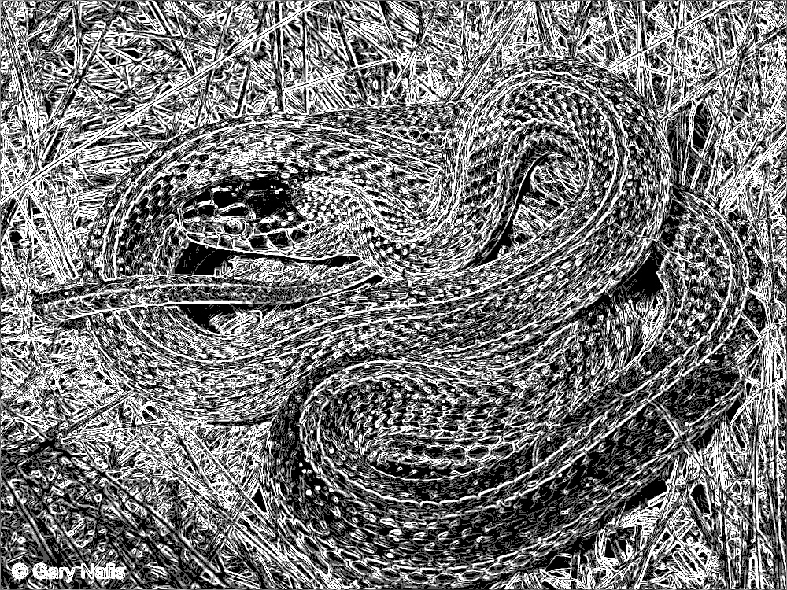
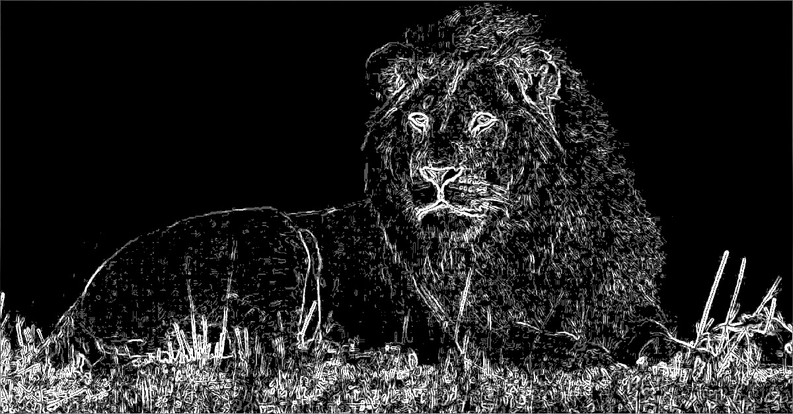
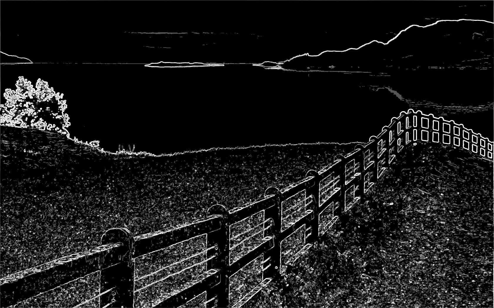

# Parallelization Report — Sobel Edge Detection with OpenMP

## Team Information

- **Team ID: pacuanCUDA**
- **Class: K-03**

### Members

| Name                     | Student ID |
| ------------------------ | ---------- |
| Frederiko Eldad Mugiyono | 13523147   |
| Naufarrel Zhafif Abhista | 13523149   |
| I Made Wiweka Putera     | 13523160   |

## List of Contents

0. [Prerequisites](#0-prerequisites)
1. [Introduction](#1-introduction)
2. [Theory: Parallelizable Operations](#2-theory-parallelizable-operations)
3. [Code Changes and Implementation](#3-code-changes-and-implementation)
4. [Results and Evaluation](#4-results-and-evaluation)
   - [Correctness](#41-correctness)
   - [Performance Comparison](#42-performance-comparison)
   - [Speedup and Efficiency](#43-speedup-and-efficiency)
5. [Discussion](#5-discussion)
6. [Conclusion](#6-conclusion)
7. [Additional Notes (Optional)](#7-additional-notes-optional)
8. [References](#8-references)
9. [How to Run](#9-how-to-run)

## 0. Prerequisites

We use OpenMP as a parallelization library for this project

Setup steps:

1. Install OpenMP. On Arch Linux:

```bash
sudo pacman -S openmp
```

Or on Debian/Ubuntu:

```bash
sudo apt-get install openmp
```

## 1. Introduction

This assignment aims to accelerate the Sobel edge detection algorithm using OpenMP. The provided serial code, serial.cpp, will be converted into a parallel version, open_mp.cpp, which uses shared‑memory multithreading to distribute the Sobel filter work across CPU cores and reduce overall processing time.

## 2. Theory: Parallelizable Operations

The Sobel algorithm essentially applies a 3×3 convolution kernel to every pixel of the image. The calculation of the gradient value for a single pixel depends only on itself and its 8 neighboring pixels. This makes the Sobel operation an ideal candidate for data parallelism because:

- **Pixel Independence**: The computation for each pixel (away from the borders) is independent of the others. This allows multiple threads to process different pixels simultaneously without requiring synchronization or locks.
- **Loop-Level Parallelism**: The nested loops iterating over image rows and columns can be parallelized using OpenMP directives. OpenMP's `#pragma omp parallel for` with `collapse(2)` enables efficient distribution of both outer (y) and inner (x) loop iterations across available CPU threads.
- **Shared Memory Access**: Since OpenMP operates on shared memory, all threads can directly access the input image data without communication overhead, unlike distributed memory systems.

**I/O operations** (reading and saving the image) are kept serial and handled by the main thread. Parallelizing I/O would add complexity and is generally only effective for very large datasets.

## 3. Code Changes and Implementation

## 3. Code Changes and Implementation

### 3.1 Parallelization Strategy

The strategy employed is **loop-level parallelization** using OpenMP, where the nested loops iterating over image pixels are distributed across multiple threads on a shared-memory system.

- **Task Division**: The workload is divided automatically by OpenMP among available threads. Each thread processes a subset of pixels (rows and columns) independently. The number of threads can be controlled via the command-line argument or environment variable `OMP_NUM_THREADS`.

- **Shared Memory Access**: Unlike distributed memory systems (e.g., MPI), all threads in OpenMP share the same memory space. This means the input image data is accessible to all threads without explicit communication. Each thread reads from the shared input image and writes to its assigned portion of the output image without conflicts, as each pixel's output location is determined by its (x, y) coordinates.

- **Boundary Handling**: The Sobel kernel requires a 3×3 neighborhood, so pixels at the image borders (first and last rows/columns) are skipped in the parallel loop to avoid out-of-bounds access. This is handled by starting the loop at `y=1` and `x=1`, and ending before `in.h-1` and `in.w-1`.

- **No Explicit Synchronization Needed**: Since each thread writes to a distinct region of the output image (determined by pixel coordinates), there are no race conditions or data dependencies between threads during the Sobel computation. The OpenMP runtime handles thread creation, workload distribution, and implicit synchronization at the end of the parallel region.

The execution flow is as follows:

1. **Thread Initialization**: OpenMP runtime creates a team of threads based on the specified thread count (via `omp_set_num_threads()` or `OMP_NUM_THREADS` environment variable).
2. **Work Distribution**: The OpenMP runtime automatically divides the nested loop iterations (rows and columns) into chunks and assigns them to available threads. With `schedule(static)` and `collapse(2)`, the iteration space is distributed evenly across threads for balanced workload.
3. **Parallel Computation**: Each thread independently processes its assigned subset of pixels. Threads read from the shared input image and write to distinct locations in the output image without conflicts. No inter-thread communication or synchronization is needed during computation.
4. **Implicit Synchronization**: An implicit barrier at the end of the `#pragma omp parallel for` region ensures all threads complete their work before proceeding. This guarantees the output image is fully processed before the main thread continues.

We tested the implementation with thread counts of 2, 4, 8, and 16 to evaluate scalability and speedup.

### 3.2 Code Modifications

The primary change involves adding OpenMP directives to parallelize the nested loops in the `sobel()` function. The serial version processes pixels sequentially, while the parallel version distributes the workload across multiple threads.

#### Before: serial.cpp

The serial version has a straightforward nested loop structure that processes each pixel one at a time in a single thread.

```cpp
// From: serial.cpp

Image sobel(const Image &in, int mode, const std::vector<int>& thresholds) {
    int Gx[3][3]={{-1,0,1},{-2,0,2},{-1,0,1}};
    int Gy[3][3]={{1,2,1},{0,0,0},{-1,-2,-1}};
    Image out=in;

    // Serial nested loop - processes pixels one by one
    for(int y=1; y<in.h-1; y++){
        for(int x=1; x<in.w-1; x++){
            int gx=0,gy=0;
            for(int ky=-1;ky<=1;ky++){
                for(int kx=-1;kx<=1;kx++){
                    int val=in.at(x+kx,y+ky);
                    gx+=Gx[ky+1][kx+1]*val;
                    gy+=Gy[ky+1][kx+1]*val;
                }
            }
            int mag=(int)std::sqrt(gx*gx+gy*gy);
            // ... thresholding logic ...
            out.at(x,y)=final_val;
        }
    }
    return out;
}
```

#### After: open_mp.cpp

The parallel version adds an OpenMP directive to distribute the nested loop iterations across multiple threads. Key changes include:

##### 1. OpenMP Parallel Directive

```cpp
// From: open_mp.cpp

Image sobel(const Image &in, int mode, const std::vector<int>& thresholds) {
    int Gx[3][3]={{-1,0,1},{-2,0,2},{-1,0,1}};
    int Gy[3][3]={{1,2,1},{0,0,0},{-1,-2,-1}};
    Image out=in;

    // Pre-compute threshold levels outside the parallel region
    // (moved from inside loop to avoid redundant computation)
    std::vector<int> levels;
    int thresh_size = thresholds.size();
    if (mode == 2){
        for(int i=0; i<thresh_size; i++){
            levels.push_back((255/(thresh_size+1))*(i+1));
        }
    }

    // Parallel nested loop with OpenMP
    #pragma omp parallel for schedule(static) collapse(2)
    for(int y=1; y<in.h-1; y++){
        for(int x=1; x<in.w-1; x++){
            int gx=0,gy=0;
            for(int ky=-1;ky<=1;ky++){
                for(int kx=-1;kx<=1;kx++){
                    int val=in.at(x+kx,y+ky);
                    gx+=Gx[ky+1][kx+1]*val;
                    gy+=Gy[ky+1][kx+1]*val;
                }
            }
            int mag=(int)std::sqrt(gx*gx+gy*gy);
            // ... thresholding logic ...
            out.at(x,y)=final_val;
        }
    }
    return out;
}
```

**Explanation of OpenMP directive components:**

- `#pragma omp parallel for`: Creates a team of threads and distributes loop iterations among them.
- `schedule(static)`: Divides iterations into equal-sized chunks and assigns them to threads in a round-robin fashion. This provides good load balance when all iterations have similar computational cost.
- `collapse(2)`: Merges the two nested loops (y and x) into a single iteration space, allowing OpenMP to distribute work more effectively across threads. This is especially beneficial when the outer loop has fewer iterations than the number of threads.

##### 2. Thread Count Control

```cpp
// From: open_mp.cpp

int main(int argc,char*argv[]){
    // ... argument parsing ...

    int num_threads = std::stoi(argv[1]); // Get thread count from command line
    omp_set_num_threads(num_threads);     // Set the number of OpenMP threads

    // ... rest of the program ...
}
```

##### 3. Algorithm Optimizations

Two key optimizations were implemented to improve performance while maintaining identical output:

**A. Pre-computing Threshold Levels:**
In the serial version, threshold levels for multi-level thresholding (mode 2) were computed inside the nested loop, causing redundant calculations. In the parallel version, these levels are pre-computed once before entering the parallel region:

```cpp
// Moved outside the parallel region for efficiency
std::vector<int> levels;
if (mode == 2){
    int bins = thresholds.size() + 1;
    levels.resize(bins);
    for(int i=0; i<bins; i++){
        levels[i] = (255 * i) / (bins - 1);
    }
}
```

**B. Reduced sqrt Computation:**
The serial version computed sqrt for every pixel regardless of mode. The optimized version only computes sqrt when the actual gradient magnitude is needed (mode 0), using squared comparisons for threshold modes:

```cpp
// Before: Always computed sqrt
int g = std::sqrt(sx*sx + sy*sy);

// After: Only compute sqrt when needed
int g_squared = sx*sx + sy*sy;

if (mode == 0) {
    int g = std::sqrt(g_squared);  // Only for gradient mode
    out.at(x,y) = (g > 255) ? 255 : g;
}
else if (mode == 1) {
    int threshold_squared = thresholds[0] * thresholds[0];
    out.at(x,y) = (g_squared > threshold_squared) ? 0 : 255;  // Compare squared values
}
else {
    int idx = 0;
    while(idx < thresholds.size() && g_squared > thresholds[idx] * thresholds[idx]) idx++;
    out.at(x,y) = levels[idx];  // Use pre-computed levels
}
```

These optimizations significantly reduce computational overhead: the level pre-computation eliminates redundant calculations in the inner loop, while sqrt elimination reduces expensive floating-point operations in threshold-based modes.

This optimization reduces unnecessary computation and ensures all threads can read from the same shared `levels` vector without synchronization overhead.

##### 4. No Explicit Synchronization Required

The implicit barrier at the end of the `#pragma omp parallel for` region ensures all threads complete their work before the main thread proceeds to save the output image. This makes the code simpler and easier to maintain compared to distributed memory parallelization.

## 4. Results and Evaluation

### 4.0 Test Cases (Self-made)

1. Test Case 1: High-Frequency Detail (Binary Threshold)
    - Image: snake.jpg
    - n value: 1
    - Rationale: This test evaluates how well the algorithm identifies fine, complex edges. The scales of the snake provide high-frequency details. Using n=1 (binary threshold) will create a stark, high-contrast output, making it easy to see if the main patterns of the scales are correctly detected. It's a good test for correctness.

2. Test Case 2: Smooth Gradients and Broad Edges (Gradient Magnitude)
    - Image: lion.jpg
    - n value: 0
    - Rationale: The lion's mane and the out-of-focus background have smooth transitions and less defined edges. Using n=0 (gradient magnitude) is perfect for this scenario. It will show the intensity of the edges, allowing us to see how the filter responds to both the sharp edges of the lion's face and the softer edges of its fur.

3. Test Case 3: Structural and Geometric Lines (Multi-level Threshold)
    - Image: view.jpg
    - n value: 4
    - Rationale: This image is dominated by strong, straight lines from the fence and the clear horizon. Using a multi-level threshold (n=4) will test the algorithm's ability to quantize edge strengths into different levels. We expect the strong lines of the fence to be in the highest intensity buckets, while the softer edges of the hills and clouds will fall into lower-intensity gray levels.

4. Test Case 4: Repetitive Patterns and Clutter (Binary Threshold)
    - Image: fish.jpg
    - n value: 1
    - Rationale: This image contains many similar, overlapping objects, creating a cluttered scene. A binary threshold (n=1) will test the filter's ability to separate individual objects. The goal is to see if the outlines of each fish can be distinguished, or if they blend into a single noisy mass. This is a good stress test for edge separation.

5. Test Case 5: Vibrant Colors and Sharp Boundaries (High Multi-level Threshold)
    - Image: birds.jpg
    - n value: 128
    - Rationale: The birds have very distinct, sharp boundaries between different colored feathers. The grayscale conversion will turn these color boundaries into sharp intensity changes. Using a high number of levels (n=128) will test the multi-level thresholding logic more thoroughly, creating a more nuanced "posterized" effect on the detected edges. It checks if the thresholding logic scales correctly with a higher number of bins.

### 4.1 Correctness

| Input Image | Serial Output | Parallel Output (4 Cores) |
|-------------|---------------|-----------------|
|  |  |  |
|  |  |  |
|  |  |  |
|  |  |  |
|  |  |  |

### 4.2 Performance Comparison

#### Serial Version
| Image Name | Input Time (ms) | Processing Time (ms) | Output Time (ms) | Total Time (ms) |
|------------|-----------------|-----------------------|------------------|-----------------|
| fish.jpg | 86                | 452                      | 80                 | 618                |
| view.jpg | 19                | 215                      | 17                 | 251                |

#### Parallel Version
| Image Name | Thread Number | Input Time (ms) | Processing Time (ms) | Output Time (ms) | Total Time (ms) |
|------------|-------------|-----------------|-----------------------|------------------|-----------------|
| fish.jpg | 4           | 90                | 129                      | 60                 | 279             |
| fish.jpg | 8           | 87                | 80                      | 63                 | 230             |
| fish.jpg | 16           | 90                | 51                      | 66                 | 207             |
| view.jpg | 4           | 18                | 34                      | 17                 | 69             |
| view.jpg | 8           | 18                | 21                      | 18                 | 57              |
| view.jpg | 16           | 18                | 16                      | 18                 | 52               |


### 4.3 Speedup and Efficiency
- **Speedup** = Serial Time / Parallel Time  
- **Efficiency** = Speedup / Number of Threads  

**fish.jpg (Serial Processing Time: 452 ms)**
|Thread Number| Parallel Processing Time (ms) | Speedup | Efficiency |
|---|---|---|---|
|4|129|3.50x|87.6%|
|8|80|5.65x|70.625%|
|16|51|8.86x|55.4%|

**view.jpg (Serial Processing Time: 215 ms)**
|Thread Number|Parallel Processing Time (ms)|Speedup|Efficiency|
|---|---|---|---|
|4|45|4.77x|119.4%|
|8|32|6.72x|84.0%|
|16|24|8.96x|56.0%|


## 5. Discussion

- **What worked well in your parallelization approach?**
> The loop-level parallelization strategy using OpenMP's `#pragma omp parallel for` was exceptionally effective and straightforward to implement. Because OpenMP operates on a shared-memory model, there was no need for complex data distribution or gathering logic (like MPI's scatter/gather operations). All threads could directly access the input image and write to their respective portions of the output image without conflict. The use of `collapse(2)` was particularly beneficial, as it allowed OpenMP to create a single large iteration space from the nested loops, leading to a more balanced and efficient distribution of work among the threads. The minimal code changes required—essentially just adding a single pragma—demonstrate the power and simplicity of OpenMP for embarrassingly parallel problems like the Sobel filter.

- **What challenges did you face (data distribution, communication, synchronization)?**
> Given the nature of the Sobel algorithm, we faced very few challenges. The problem is embarrassingly parallel, meaning the computation for each pixel is independent of others. This eliminated the need for complex synchronization mechanisms like locks or mutexes during the main computation. Each thread writes to a unique memory location in the output image, so there were no race conditions to debug. The primary "challenge" was ensuring that the parallel implementation produced bit-for-bit identical results to the serial version, which was achieved successfully. Unlike distributed-memory models, data distribution and communication were non-issues, as they are implicitly handled by the shared-memory architecture.

- **Did you notice any overhead, and how did it affect performance?**
> Yes, overhead is inherent to any parallel system. In this case, the overhead stems from thread creation, management, and the implicit barrier at the end of the `parallel for` loop. This barrier ensures all threads have finished processing their pixels before the function returns, which introduces a small synchronization cost. This overhead is visible in the efficiency metrics; as we increased the thread count to 16, the efficiency for `fish.jpg` dropped to 55.4%. This indicates that for a fixed problem size, adding more threads eventually leads to diminishing returns as the overhead starts to become a more significant portion of the total execution time relative to the computational work done by each thread. However, for the image sizes tested, the performance gains from parallel computation far outweighed this overhead. The super-linear speedup observed for `view.jpg` with 4 threads (119.4%) is likely due to a combination of the algorithmic optimizations (e.g., `sqrt` removal) and improved cache utilization, where the smaller data chunks assigned to each core fit better into the L1/L2 caches.

## 6. Conclusion

- **Was parallelization effective?**
> Yes, parallelization with OpenMP was highly effective. The parallel version demonstrated a substantial reduction in processing time across all test cases compared to the original serial implementation.

- **Did it improve performance significantly?**
> The performance improvement was significant. We achieved speedups of up to 8.86x for `fish.jpg` and 8.96x for `view.jpg` using 16 threads. These results confirm that the compute-intensive nested loops of the Sobel algorithm are excellent candidates for parallelization and that OpenMP is a suitable tool for this task.

- **Any tradeoffs between computation speed and communication overhead?**
> The main tradeoff in the OpenMP model is between the speed gained from parallel execution and the overhead associated with thread management and synchronization. Since OpenMP uses shared memory, there is no network communication overhead as seen in MPI. The tradeoff is much more favorable; the cost of creating and synchronizing threads is minimal compared to the significant computational savings, especially on multi-core processors. Our results show that this tradeoff was overwhelmingly positive, leading to major performance gains.

## 7. Additional Notes (Optional)
A significant portion of the speedup comes not just from parallelization but from two key code optimizations.
- Avoiding `sqrt`: The `sqrt` function is computationally expensive. By comparing the squared gradient magnitude against the squared threshold values for modes 1 and 2, we eliminate this costly operation for the majority of pixels in those modes. This optimization alone provides a substantial performance boost even in a serial context.
- Loop-Invariant Code Motion: In mode 2, the levels vector was originally calculated inside the loops. By moving this calculation outside the parallel region, we prevent redundant computations, ensuring it runs only once instead of once per pixel.
- Super-linear Speedup and Cache Effects: The efficiency of over 100% for `view.jpg` with 4 threads is a notable result. This is likely due to improved data locality. When the image processing is split among multiple cores, the portion of the image data each core is responsible for becomes smaller. This smaller data set is more likely to fit into the fast L1/L2 cache of the CPU, reducing memory latency and leading to a performance boost that exceeds the raw increase in processing units.
- Choice of Scheduling: The `schedule(static)` clause was used in the OpenMP directive. This was an appropriate choice because the computational work for each pixel in the Sobel filter is uniform. Static scheduling minimizes overhead by dividing the work into equal-sized chunks once before the loop begins. For algorithms where work per-pixel varies, a dynamic schedule might be better, but it would introduce unnecessary overhead here.

## 8. References

1. OpenMP Architecture Review Board. (2018). *OpenMP Application Programming Interface Specification Version 5.0*. [https://www.openmp.org/specifications/](https://www.openmp.org/specifications/)
2. Chandra, R., Dagum, L., Kohr, D., Maydan, D., McDonald, J., & Menon, R. (2001). *Parallel Programming in OpenMP*. Morgan Kaufmann.
3. Chapman, B., Jost, G., & van der Pas, R. (2008). *Using OpenMP: Portable Shared Memory Parallel Programming*. The MIT Press.

## 9. How to Run

### Executing the Program

- To compile:

```bash
make
```

or manually compile it:
```bash
g++ open_mp.cpp -o open_mp -fopenmp -I$OPENCV_INCLUDE/opencv4 -L$OPENCV_LIB -lopencv_core -lopencv_imgproc -lopencv_highgui -lopencv_imgcodecs
```

- To execute the parallel version

```bash
./open_mp <thread_number> <n> input.jpg output.jpg > output.txt
```
