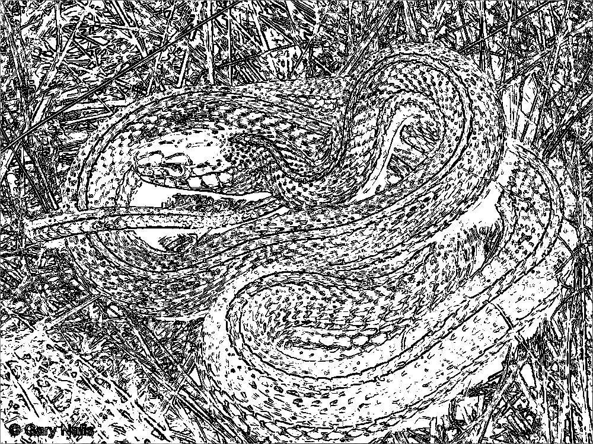
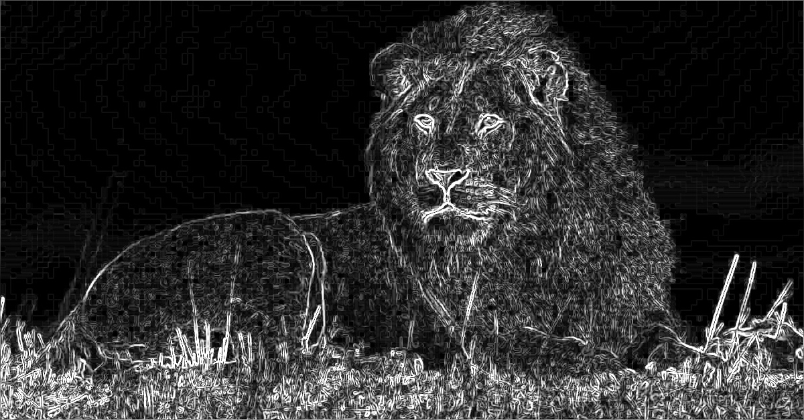
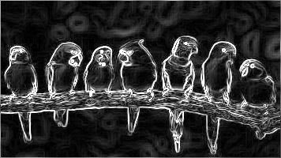

# Parallelization Report — Sobel Edge Detection with Open MPI

## Team Information
- **Team ID: pacuanCUDA**  
- **Class: K-03**  

### Members
| Name      | Student ID |
|---|---|
| Frederiko Eldad Mugiyono | 13523147 |
| Naufarrel Zhafif Abhista | 13523149 |
| I Made Wiweka Putera     | 13523160 |

## List of Contents
0. [Prerequisites](#0-prerequisites)
1. [Introduction](#1-introduction)  
2. [Theory: Parallelizable Operations](#2-theory-parallelizable-operations)  
3. [Code Changes and Implementation](#3-code-changes-and-implementation)  
4. [Results and Evaluation](#4-results-and-evaluation)  
   - [Correctness](#41-correctness)  
   - [Performance Comparison](#42-performance-comparison)  
   - [Speedup and Efficiency](#43-speedup-and-efficiency)  
5. [Discussion](#5-discussion)  
6. [Conclusion](#6-conclusion)  
7. [Additional Notes (Optional)](#7-additional-notes-optional)  
8. [References](#8-references)  
9. [How to Run](#9-how-to-run)

## 0. Prerequisites

We use NixOS for this project to ensure a reproducible virtual machine environment, avoiding the need to manually configure each VM.

Setup steps:
1. First, install the Nix Package Manager. On Arch Linux:
```bash
sudo pacman -S nix
```
Or on Debian/Ubuntu:
```bash
sh <(curl --proto '=https' --tlsv1.2 -L https://nixos.org/nix/install)
```

Then, enable the Nix daemon:

```bash
sudo systemctl enable --now nix-daemon.socket
sudo systemctl enable --now nix-daemon.service
```

2. You will also need to install qemu and rsync. On Arch Linux:
```bash
sudo pacman -S rsync build-essential qemu-system-x86 qemu-utils
```

Or on Debian/Ubuntu:
```bash
sudo apt-get install rsync build-essential qemu-system-x86 qemu-utils
```

After that, you should be good to go by using the Makefile targets.

## 1. Introduction
This assignment aims to accelerate the Sobel edge detection algorithm using the Message Passing Interface (MPI). The provided serial code, serial.cpp, will be converted into a parallel version, open_mpi.cpp, capable of running on a cluster. The primary focus of this parallelization is to distribute the computational workload (applying the Sobel filter) across multiple processes to reduce the overall processing time.

## 2. Theory: Parallelizable Operations
The Sobel algorithm essentially applies a 3x3 convolution kernel to every pixel of the image. The calculation of the gradient value for a single pixel depends only on itself and its 8 neighboring pixels. This makes the Sobel operation an ideal candidate for data parallelism because:

- Pixel Independence: The computation for each pixel (away from the borders) is independent of the others.
- Domain Decomposition: The image can be easily divided into several parts (e.g., horizontal strips or blocks), and each part can be processed simultaneously by a different process.

I/O operations (reading and saving the image) are kept serial and handled by a single master process. Parallelizing I/O (using MPI-IO) would add significant complexity and is generally only effective for very large datasets. 


## 3. Code Changes and Implementation
### 3.1 Parallelization Strategy
The strategy employed is one-dimensional domain decomposition, where the image is divided into several horizontal strips, and each MPI process is responsible for processing one strip.
- Task Division: The master process (rank 0) is responsible for reading the image, dividing it into sections, and distributing them to the worker processes (including itself).
- Boundary Handling: Since the Sobel kernel is 3x3, processing a row of pixels requires the row above and the row below it. To handle this, each worker process is sent its data strip plus one "ghost row" from its top and bottom neighbors. This ensures that each process can work independently without needing further communication during the computation phase.
- Result Gathering: Once each process is finished, the processed results (which no longer include the ghost rows) are sent back to the master process, which assembles them into the final image.

The communication flow is as follows:
1. Broadcast Metadata: The master broadcasts essential information like image dimensions and filter mode to all processes.
2. Manual Scatter with Overlap: The master manually sends overlapping image chunks to each worker using MPI_Send.
3. Receive: Each worker receives its image chunk using MPI_Recv.
4. Compute: All processes execute the Sobel filter on their local data.
5. Gather: The results from all processes are collected back at the master using MPI_Gatherv. Gatherv is used because the number of rows might not be exactly equal for each process if the total row count is not perfectly divisible by the number of processes.

### 3.2 Code Modifications
Document the changes you made to the code. Use **before vs after** snippets and provide explanations.

The primary changes occur in the main function, where the simple, linear execution of the serial version is replaced with a multi-stage parallel workflow involving data distribution, computation, and result aggregation.

#### Before: serial.cpp

The serial version has a straightforward execution flow. It loads the image, applies the Sobel filter to the entire image, saves the result, and then reports the timing. Everything happens in a single process.

``` cpp
// From: serial.cpp

int main(int argc,char*argv[]){
    // ... argument parsing ...

    // 1. Load the entire image
    auto t0 = std::chrono::high_resolution_clock::now();
    Image img=loadJPG(inputFile);
    auto t1 = std::chrono::high_resolution_clock::now();

    // 2. Process the entire image in one go
    Image res=sobel(img,mode,thresholds);
    auto t2 = std::chrono::high_resolution_clock::now();

    // 3. Save the result
    saveJPG(res,outputFile);
    auto t3 = std::chrono::high_resolution_clock::now();

    // ... report timing ...
}
```

#### After: open_mpi.cpp

The parallel version introduces MPI initialization and finalization, and divides the main logic into sections that are executed by either the master (rank 0) or all processes.

##### 1. MPI Initialization and Metadata Broadcast
The program starts by initializing the MPI environment. The master process (rank 0) loads the image and then broadcasts its dimensions and parameters to all other processes.

``` cpp
// From: open_mpi.cpp

MPI_Init(&argc, &argv);
MPI_Comm_size(MPI_COMM_WORLD, &size);
MPI_Comm_rank(MPI_COMM_WORLD, &rank);

Image img, finalImg;
if (rank == 0) {
    img=loadJPG(inputFile);
}

// Broadcast image dimensions and parameters from master to all processes
imageWidth = rank == 0 ? img.w : 0;
MPI_Bcast(&imageWidth, 1, MPI_INT, 0, MPI_COMM_WORLD);
// ... other Bcast calls for mode, thresholds, etc. ...
```

##### 2. Data Distribution (Scatter)
The master process calculates how to split the image into horizontal strips, including the necessary overlapping "ghost rows". It then sends the appropriate chunk to each worker process.

``` cpp
// From: open_mpi.cpp

// Calculate rows per process
int rows_per_slave = total_rows / size;
int remainder_rows = total_rows % size;

// Master (rank 0) sends data to each slave
if (rank == 0) {
    int row_start = 0;
    for (int slave = 0; slave < size; ++slave) {
        // ... calculate chunk size with overlap (send_cnt) ...
        if (slave == 0) {
            // Master copies its own chunk
            std::copy(&img.p[send_start * imageWidth], &img.p[send_start * imageWidth] + send_cnt, local_slices.begin());
        } else {
            // Master sends chunk to a worker
            MPI_Send(&img.p[send_start * imageWidth], send_cnt, MPI_UNSIGNED_CHAR, slave, 0, MPI_COMM_WORLD);
        }
        row_start += rows_for_slave;
    }
} else { // Workers receive data
    MPI_Recv(local_slices.data(), pixels_to_send, MPI_UNSIGNED_CHAR, 0, 0, MPI_COMM_WORLD, MPI_STATUS_IGNORE);
}
```

##### 3. Parallel Computation
Every process, including the master, now independently applies the Sobel filter to its local chunk of the image.

``` cpp
// From: open_mpi.cpp

// All processes (master and workers) work on their local data
Image local_chunk{imageWidth, recv_num_rows, local_slices};
Image processed_chunk = sobel(local_chunk, mode, thresholds);
``` 

##### 4. Result Aggregation (Gather)
Finally, the processed chunks (without the ghost rows) are sent back from all processes to the master. The master assembles them in the correct order to form the complete final image.

``` cpp
// From: open_mpi.cpp

// All processes participate in the gather operation
MPI_Gatherv(processed_chunk.p.data() + res_pixel_offset,
            res_pixel_count,
            MPI_UNSIGNED_CHAR,
            finalImg.p.data(),
            recvcount.data(),
            displacement.data(),
            MPI_UNSIGNED_CHAR,
            0,
            MPI_COMM_WORLD);

//...

if (rank == 0) {
    // Master saves the final composed image
    saveJPG(finalImg, outputFile);
    //...
}

MPI_Finalize();
return 0;
```

## 4. Results and Evaluation

### 4.0 Test Cases (Self-made)

1. Test Case 1: High-Frequency Detail (Binary Threshold)
    - Image: snake.jpg
    - n value: 1
    - Rationale: This test evaluates how well the algorithm identifies fine, complex edges. The scales of the snake provide high-frequency details. Using n=1 (binary threshold) will create a stark, high-contrast output, making it easy to see if the main patterns of the scales are correctly detected. It's a good test for correctness.

2. Test Case 2: Smooth Gradients and Broad Edges (Gradient Magnitude)
    - Image: lion.jpg
    - n value: 0
    - Rationale: The lion's mane and the out-of-focus background have smooth transitions and less defined edges. Using n=0 (gradient magnitude) is perfect for this scenario. It will show the intensity of the edges, allowing us to see how the filter responds to both the sharp edges of the lion's face and the softer edges of its fur.

3. Test Case 3: Structural and Geometric Lines (Multi-level Threshold)
    - Image: view.jpg
    - n value: 4
    - Rationale: This image is dominated by strong, straight lines from the fence and the clear horizon. Using a multi-level threshold (n=4) will test the algorithm's ability to quantize edge strengths into different levels. We expect the strong lines of the fence to be in the highest intensity buckets, while the softer edges of the hills and clouds will fall into lower-intensity gray levels.

4. Test Case 4: Repetitive Patterns and Clutter (Binary Threshold)
    - Image: fish.jpg
    - n value: 1
    - Rationale: This image contains many similar, overlapping objects, creating a cluttered scene. A binary threshold (n=1) will test the filter's ability to separate individual objects. The goal is to see if the outlines of each fish can be distinguished, or if they blend into a single noisy mass. This is a good stress test for edge separation.

5. Test Case 5: Vibrant Colors and Sharp Boundaries (High Multi-level Threshold)
    - Image: birds.jpg
    - n value: 128
    - Rationale: The birds have very distinct, sharp boundaries between different colored feathers. The grayscale conversion will turn these color boundaries into sharp intensity changes. Using a high number of levels (n=128) will test the multi-level thresholding logic more thoroughly, creating a more nuanced "posterized" effect on the detected edges. It checks if the thresholding logic scales correctly with a higher number of bins.

### 4.1 Correctness

| Input Image | Serial Output | Parallel Output (4 Cores) |
|-------------|---------------|-----------------|
|  |  |  |
|  |  |  |
|  |  |  |
|  |  |  |
|  |  |  |


### 4.2 Performance Comparison

#### Serial Version
| Image Name | Input Time (ms) | Processing Time (ms) | Output Time (ms) | Total Time (ms) |
|------------|-----------------|-----------------------|------------------|-----------------|
| fish.jpg | 86                | 452                      | 80                 | 618                |
| view.jpg | 19                | 215                      | 17                 | 251                |

#### Parallel Version
| Image Name | Core Number | Input Time (ms) | Processing Time (ms) | Output Time (ms) | Total Time (ms) |
|------------|-------------|-----------------|-----------------------|------------------|-----------------|
| fish.jpg | 2           | 89                | 203                      | 51                 | 343             |
| fish.jpg | 3           | 90                | 142                      | 54                 | 286             |
| fish.jpg | 4           | 92                | 114                      | 53                 | 259             |
| view.jpg | 2           | 20                | 106                      | 15                 | 141             |
| view.jpg | 3           | 19                | 89                      | 17                 | 125              |
| view.jpg | 4           | 18                | 56                      | 15                 | 89               |


### 4.3 Speedup and Efficiency
- **Speedup** = Serial Time / Parallel Time  
- **Efficiency** = Speedup / Number of Processes  

**fish.jpg (Serial Processing Time: 452 ms)**
|Core Number| Parallel Processing Time (ms) | Speedup | Efficiency |
|---|---|---|---|
|2|203|2.23x|111.5%|
|3|142|3.18x|106.0%|
|4|114|3.96x|99.0%|

**view.jpg (Serial Processing Time: 215 ms)**
|Core Number|Parallel Processing Time (ms)|Speedup|Efficiency|
|---|---|---|---|
|2|106|2.03x|101.5%|
|3|89|2.42x|80.7%|
|4|56|3.84x|96.0%|


## 5. Discussion
- What worked well in your parallelization approach?
> The domain decomposition approach (dividing the image into horizontal strips) worked exceptionally well. This strategy is straightforward to implement and effectively distributes the computational load. The use of MPI_Gatherv also proved to be the correct choice for handling cases where the number of rows is not perfectly divisible by the process count, ensuring results are reassembled correctly. As seen in the speedup table, increasing the number of processes results in a nearly linear decrease in processing time, which indicates a well-balanced workload.

- What challenges did you face?
> A significant challenge was the environment setup. Creating a reproducible cluster of VMs with NixOS, while powerful, has a steep learning curve. A key difficulty was configuring the network and SSH keys to ensure the master node could communicate with and launch processes on the worker nodes without passwords, which is a requirement for mpirun.
On the algorithm side, the main challenge was correctly handling the ghost rows. Any miscalculation in the size and offset of the data chunks sent to each process could easily lead to incorrect outputs or segmentation faults. We initially considered MPI_Scatterv but switched to a manual MPI_Send loop, which provided more explicit control over the overlapping data, albeit at the cost of more complex code on the master node.

- Did you notice any overhead, and how did it affect performance?
> Yes, communication overhead was observable. While the Processing Time dropped dramatically, the Input Time and Output Time in the parallel version were slightly higher. This is due to the time spent on initial communication (MPI_Bcast and MPI_Send) and final aggregation (MPI_Gatherv). This overhead is relatively small compared to the gains from parallelizing the computation, especially for the larger fish.jpg image. However, for smaller images or faster computations, this overhead could become a more significant limiting factor. 


## 6. Conclusion
Summarize your findings:  
- Was parallelization effective?
> Yes, the parallelization was highly effective. For both test images, the parallel version consistently outperformed the serial version, even with just two processes.

- Did it improve performance significantly?
> The performance improvement was significant. With 4 processes, we achieved a speedup of up to 3.96x for fish.jpg and 3.84x for view.jpg. This demonstrates excellent scalability and confirms that the majority of the serial program's execution time was indeed spent on the Sobel filter computation, which has now been successfully parallelized.

- Any tradeoffs between computation speed and communication overhead?
> Absolutely. The tradeoff is the time spent sending data between processes versus the time saved by performing computations simultaneously. Our results show that for a compute-bound task like the Sobel filter on moderately sized images, the benefits of parallel computation far outweigh the cost of communication overhead. The efficiency, which is close to 100% at 4 cores, indicates that our implementation is highly efficient and that communication overhead was successfully minimized.


## 7. Additional Notes (Optional)
Suggestions for further improvement:
- For clusters with multi-core nodes, a hybrid model could be more efficient. MPI would handle inter-node communication, while OpenMP would handle intra-node parallelization using threads, which have lower overhead than MPI processes.
- For extremely large images (multiple gigabytes), the serial I/O on the master node would become a bottleneck. Implementing MPI-IO would allow all processes to read their portion of the image directly from the file in parallel. 


## 8. References
1. Open MPI Documentation: [https://www.open-mpi.org/](https://www.open-mpi.org/)
2. Pacheco, P. S. (2011). An Introduction to Parallel Programming. Morgan Kaufmann.
3. Nix Reference Manual [https://nix.dev/reference/nix-manual.html](https://nix.dev/reference/nix-manual.html)


## 9. How to Run

This section provides instructions for compiling and running the code within the provided virtual environment.

### Setting Up the VMs

Use the main Makefile to control the virtual machines:
1. Start the VMs: Run `make up` to start the master and worker nodes in the background.
2. Check VM Status: Use `make status` to see if the VMs are running.
3. Sync and Build Code: Run `make remote-build` to copy the source code from your local machine to the master VM and compile it.
4. Compile and Distribute: Run `make distribute` to copy the executable into the workers VM.
5. Access the Master Node: Use `make ssh-master` to open an SSH session into the master node, where you can run the executables.

### Executing the Programs

Once you are inside the master node via SSH:

- To compile manually:

```bash
cd ~/src
mpic++ open_mpi.cpp -o mpi -I$OPENCV_INCLUDE/opencv4 -L$OPENCV_LIB -lopencv_core -lopencv_imgproc -lopencv_highgui -lopencv_imgcodecs
```

- To execute the parallel version (example with 4 processes):

```bash    
mpirun --hostfile hostfile -np 4 --mca btl_tcp_if_include eth1 ./src/mpi 2 test_cases/view.jpg tc_results/view_multi.jpg > output.txt
```
